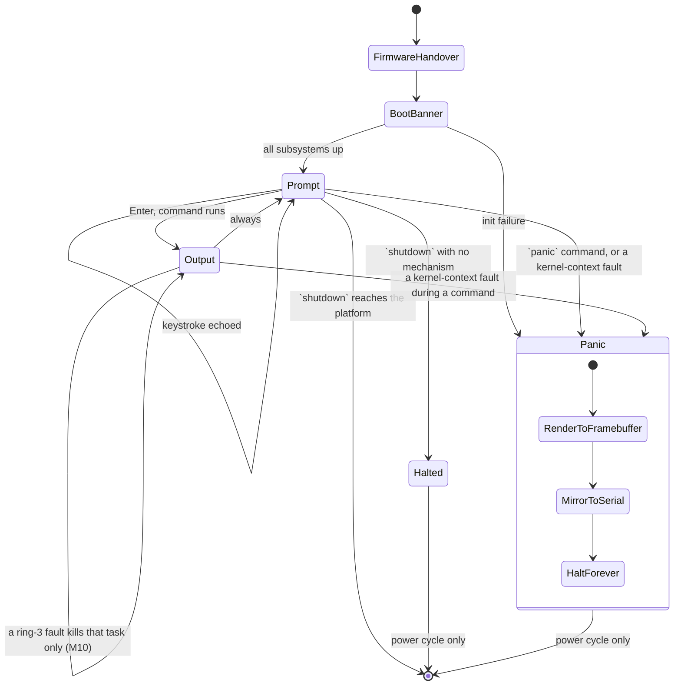

# App Flow — Osmium v1 console and shell

**Date:** 2026-08-17 · **PRD:** [PRD.md](PRD.md) · **TDD:** [TDD.md](TDD.md)

## Entry points

There is exactly one, and it is unusual enough to be worth stating plainly: **the
machine is switched on.** Osmium has no links, no redirects, no notifications and no
deep links, because it has no network and nothing outside itself. A person arrives by
one of three routes, all of which land in the same place:

1. `cargo xtask run` — boots the BIOS image in a QEMU window.
2. `cargo xtask run --uefi` — the same, under OVMF firmware.
3. Writing an image to real media and booting a physical machine. Plausible,
   untested, and described as untested.

Two non-human entry points exist and matter as much:

4. `cargo xtask test` — headless, `selftest` feature on. Runs the battery instead of
   the shell and exits QEMU with a verdict code. This is the path CI takes.
5. The **shipped-image boot job** — the default build, booted headlessly, asserted to
   reach the prompt and then killed. It proves the artefact a person actually runs.

## The happy path

1. **Firmware hands over.** The bootloader has already set up long mode, paging and
   the framebuffer. The screen is whatever the firmware left; nothing of Osmium is
   visible yet. This lasts milliseconds and has no UI of its own.
2. **Boot banner.** The console clears to the surface colour and the initialisation
   lines appear, one per subsystem in the order the kernel brings them up: version,
   framebuffer geometry and pixel format, GDT/TSS and interrupts with the PIT rate,
   heap and frame counts. The same lines go to the serial port — they are kernel log
   content, not typed input. Then the shell prints its own two-line banner on the
   console: name, version and tagline in the accent colour, and
   `shell ready N ms after interrupts-on` — the PIT starts at `interrupts::init`, so
   earlier boot stages are outside its sight and the label says exactly what is
   measured — ending with `Type 'help' to begin.`
3. **Prompt.** The banner is followed by the prompt, `osmium> `,
   with a visible caret. The kernel is idle in a halt loop between keystrokes.
4. **The person types.** Each keystroke raises an interrupt, is decoded, and is
   echoed at the caret. Backspace deletes leftwards, and Up and Down recall history.
   Nothing typed is written to the serial log — not the keystroke, not the line, not
   the output it produces. That holds without qualification: the one route by which
   typed text could have reached serial was the `panic` command's message, and it now
   panics with a message fixed in the source.
5. **They press Enter.** The line is parsed. The prompt line stays on screen, output
   is printed beneath it, and a fresh prompt follows. An unknown verb prints
   `unknown command: xyz (try 'help')`, which is an outcome, not a failure
   state: the shell is still at step 3.
6. **They keep going, or they stop.** There is no exit. `shutdown` asks the machine
   to power off; anything else leaves them at the prompt indefinitely. Closing the
   QEMU window or cutting the power ends the session, and because nothing is
   persisted, ending it destroys everything the session held.

## The command surface

Thirteen commands, defined once in `kshared::COMMANDS` so the printed `help` list and
Tab completion share a single source. Each prints something; none is silent on
success unless its whole purpose is to clear the screen. **Tab** completes a command
verb — a unique prefix fills in, a shared prefix extends as far as it can, and an
exhausted prefix lists the candidates and keeps the input.

| Command | Does | Error case |
|---|---|---|
| `help` | Lists every command with a one-line description. Arguments are ignored — there is no longer form. | None; it always prints the list. |
| `echo <text>` | Prints its argument text back verbatim. There are no quoting rules; the text after the verb is one string. | None. No arguments prints an empty line, which is correct, not an error. |
| `clear` | Clears the screen and homes the cursor; the next prompt is at the top. | None. |
| `mem` | Heap used and free against its 1 MiB size; frames handed out of the usable total, with usable RAM in MiB. | None. Reads atomics and the heap's own counters. |
| `uptime` | Time since interrupts came up, from the 100 Hz tick counter, formatted by the host-tested `kshared::Uptime`: `up S.CC s (N ticks @ 100 Hz)` under a minute, rolling to `up Mm SS s` and `up Hh MM SS s` as it grows. | None. A broken timer shows a frozen count; proving the timer is the battery's job, not this command's. |
| `keymap` | Prints the active keyboard layout. `keymap uk` and `keymap us` switch it and confirm the change. | `keymap fr` → `usage: keymap [us\|uk]`. |
| `sysinfo` | Version and architecture; the framebuffer's geometry, pixel format and depth; usable RAM and the size of the kernel heap; the active ring-3 hardening set (SMEP/SMAP/UMIP, whichever the CPU advertised); the active keymap; then the `uptime` line, tick rate included. It does not read CPU vendor or brand strings — no part of Osmium needs to know. | None. If the firmware provided no framebuffer the display line is omitted rather than invented. |
| `privacy` | Reports the claims **as facts the build can support**, not as slogans: no network stack exists, nothing persists, freed heap blocks and handed-out frames are zeroed, keystrokes render on this screen only (never on the serial port), and user code runs in ring 3 under the CPU-advertised SMEP/SMAP/UMIP set. Ends by stating that the memory claims are self-tested and network/persistence are CI-gated, not policy. | None. |
| `user` | Runs the embedded `hello` ELF in ring 3: parse, per-segment W^X mapping, the `int 0x80` syscall path, teardown. Success prints the value the program passed to `SYS_EXIT` — its own CS, whose low two bits are the CPL. | A refused image is a diagnosis, not a crash: `user: the embedded ELF was refused:` plus the named `ElfError` variant, and nothing was mapped before the refusal. |
| `sched` | The preemption demonstration: runs `counter` (a long compute loop that never yields, printing a progress dot per eighth) and `hello` concurrently, counter launched first, round-robin on the timer tick. Their output interleaves live — hello's byte lands among counter's dots because the timer, not any yield, moves the CPU. Then a report: preemptive switch and timer round-trip counts, and each program's exit order and value — hello, launched second, exits **first**, which is the visible proof the scheduling is preemptive. | Same refusal shape as `user`: a refused image prints the named `ElfError` and nothing was mapped. |
| `crash` | The fault-isolation demonstration (M10): runs `crasher` (announces itself with a `!`, then dereferences an unmapped address at CPL 3) beside `hello`. The kernel terminates the crasher — and only it. The report names the fault vector that killed it, confirms hello exited unharmed at CPL 3, and ends with `kernel: still running - you are typing at it`, because the prompt returning is itself the proof. | If the crasher somehow exits without faulting, the report says so (`exited 0xbad without faulting (unexpected)`) instead of pretending; a refused image prints the named `ElfError` as in `user`. |
| `panic` | Deliberately panics, to demonstrate the panic screen. Documented as a demonstration, not a defect. **It takes no message argument, and that is a privacy decision rather than a missing feature:** a panic is reported on the serial port as well as the screen, so a message argument would be the one path by which something typed at this keyboard could reach serial. The message is fixed in the source instead. | None — it always succeeds by failing. Any text after the verb is ignored. |
| `shutdown` | Prints `shutting down`, then exits the VM through the `isa-debug-exit` port under QEMU. On real hardware that port write is a no-op and the machine halts — safe to switch off, since nothing was ever written to disk. | The hardware fallback is not an error; it is the honest outcome. |
| `selftest` | Re-runs the four checks that are safe to repeat — heap allocation, the zero-on-free sentinel, `int3`, and the PIT — printing one `[ ok ]` line each. It is the shell's own copy of them, not the boot battery itself: the battery is compiled in only under the `selftest` feature, and that build has no shell. **Everything else in the boot battery is left out** — the paging probe (a fixed address that cannot be mapped twice), the stack overflow (it cannot return), and the ring-3 round trip with its page-table audits, which the `user` command exercises on demand instead. The screen does not name what it leaves out, which is a gap in the output rather than in the tests. | A failing check prints `[FAIL]` in the danger colour instead of `[ ok ]`, and the shell returns to the prompt. |

## Every state of every screen

Four screens. Two of the template's six state columns do not exist here, and that is
recorded rather than left blank.

| Screen | Loading | Empty | Populated | Error | Unauthorised | Offline / slow |
|---|---|---|---|---|---|---|
| **Boot banner** | This screen *is* the loading state. Subsystem lines appear as each initialises, so a stall shows which subsystem it stalled in. | n/a — never empty; the banner is written before anything can be. | Banner plus initialisation lines plus the first prompt. | Init failure panics to the panic screen with the subsystem named. | **n/a — no accounts exist.** Whoever is at the keyboard is the operator. | **n/a — there is no network.** Every operation is local and completes in microseconds. |
| **Shell prompt** | n/a — no waiting; the kernel halts between keystrokes and wakes on interrupt. | The first-run state: banner, then `osmium> `. It is explained, not blank: the banner directly above it says `Type 'help' to begin.` | The prompt with a partially typed line; typed characters appear at the insertion point. | A keystroke that produces no character (an unmapped key) is ignored silently; a full input buffer beeps nothing and simply refuses the character. | n/a | n/a |
| **Command output** | n/a — every command completes in well under a frame. | Commands with nothing to report still print their headline line rather than a blank. | Output beneath the command line, then a new prompt. | Errors are stated in words with the remedy inline — `unknown command: xyz (try 'help')`, `usage: keymap [us\|uk]` — so text alone carries the signal and colour is never the only cue. The shell returns to the prompt; nothing is lost. | n/a | n/a |
| **Panic screen** | n/a | n/a | n/a | **This screen is only ever the error state.** A danger-coloured `*** KERNEL PANIC ***` heading, then the panic message with its source file and line — for CPU exceptions the message includes the interrupt stack frame, and a page fault names the faulting address. Danger-coloured text, not a flooded background; see the [Design Brief](DESIGN_BRIEF.md) for why. The same text goes to serial. It ends with what to do: `The system is halted; reset the machine or close QEMU.` | n/a | n/a |

Two entries above deserve to be stated outright rather than inferred from a table
cell. **Unauthorised is not applicable because Osmium has no accounts or sessions**
— though no longer because there is no privilege boundary. Since M6 there are two
rings: the kernel drops to ring 3 to run embedded user programs (the `user` and
`sched` commands), which can touch nothing of the kernel's — the kernel's page
table never carries a user-accessible entry, audited by the battery before ring 3
has ever run and again after every run — and each returns through `int 0x80`.
Since M8 up to two programs run concurrently under preemptive round-robin, and
since M9 each runs in its own address space, isolated from the others' memory as
well as the kernel's. Since M10 a fault in one of them terminates that task
alone (the `crash` command demonstrates it live); only a kernel-context fault
reaches the panic screen. There is still nothing to authenticate against:
whoever is at the keyboard is the operator, and physical access is total
access. **Offline is not applicable because
there is no network stack**. A state that depends on a remote response cannot occur
where no remote call can be made. Both cells stay "n/a" until accounts or networking
exist, at which point this document is rewritten before that code is written.

## Transitions

In the self-test build the graph is different and shorter, which is worth drawing
attention to because it is why the shipped-image boot job exists: `BootBanner` goes
to `Battery`, and `Battery` exits QEMU with 33 or 35 without ever reaching `Prompt`.

## Permissions per state

There is one operator, and the only privilege boundary is the ring 3 the kernel
itself drops into for the `user` command — nothing a person can log into or be
locked out of — so this section is short and its
brevity is the design. Anyone who can reach the keyboard can reach every state,
including `panic` and `shutdown`. There is no state a person can be locked out of and
no state they can be ejected from, because there is nothing to authenticate against.

**What changes when access is revoked while someone is on a screen?** Nothing can be
revoked remotely; there is no channel to revoke it over. The only revocation
available is physical: switching the machine off. Because there is no persistence and
freed memory is zeroed, that revocation is complete and immediate, and it takes every
state with it. This is the same answer as in the PRD, and it is the strongest form of
the guarantee rather than the absence of one.

## Dead ends

Two states have no way forward, and both are deliberate. The rule that matters is the
one about a permanent error dressed as a transient one, and both are worded to obey
it.

- **The panic screen.** A kernel panic is terminal by definition: the kernel has
  detected that its own invariants are broken and stops rather than continuing to
  operate on state it no longer trusts. The screen therefore **never says "retry" or
  "refresh"**, because retrying is not available and implying it would be a lie. It
  says the machine has stopped, that nothing was written to disk, and that a power
  cycle is the way back. That is a complete instruction, so it is a documented
  terminal state rather than a dead end in the defect sense.
- **The halted state after `shutdown` on a platform with no power-off mechanism.**
  Also terminal, and preceded by `shutting down`, so the stop is announced rather
  than silent.

Everything else returns to the prompt. There is no command that leaves the shell
unresponsive, no modal state, and no way to get stuck part-way through entering
something: backspace erases and Enter always submits (a blank line is simply a new
prompt).

## Accessibility

Honesty first, because the usual framing does not transfer: **Osmium is a bare-metal
kernel with no accessibility API, no screen reader, and no assistive-technology
interface.** A screen reader running on the host operating system cannot see inside a
QEMU framebuffer window. Claiming a screen-reader story would be false. What can be
claimed is claimed, and the design choices that follow are made because of it.

- **The keyboard is the only input device, so the keyboard path is the whole
  interface**. There is no mouse to fall back to and nothing that can only be
  reached by pointing.
- **Focus is unambiguous and always visible.** There is one focus point, the caret at
  the prompt, and it is always rendered. There are no focusable elements to order and
  nothing that can steal focus.
- **Colour is never the only signal.** A failing self-test check is marked `[FAIL]`
  where a passing one reads `[ ok ]`; an unknown command says so in words; the panic
  screen is headed `KERNEL PANIC` in words. Every one of these reads correctly in
  monochrome, and it has to, because the serial log is monochrome and the serial log
  is what CI reads.
- **The serial stream carries the kernel's side of the story, not the shell's.**
  Boot lines, self-test verdicts and panics all reach serial in plain text, where a
  person's own assistive technology works — so bringing the machine up and
  diagnosing it does not require reading the framebuffer. The shell itself renders
  to the local console only; that is the keystroke-privacy rule, and it makes serial
  a diagnostic route, not an interactive one. Claiming more would trade a privacy
  guarantee for an accessibility claim the code deliberately does not honour.
- **Nothing blinks, nothing animates, nothing is time-limited.** There is no
  animation to reduce and no prompt that expires while someone reads it.
- **Legibility is a fixed constraint**, not a preference: see the
  [Design Brief](DESIGN_BRIEF.md) for the type sizes, the contrast floor and the
  reason the console is not dense green text on black.
