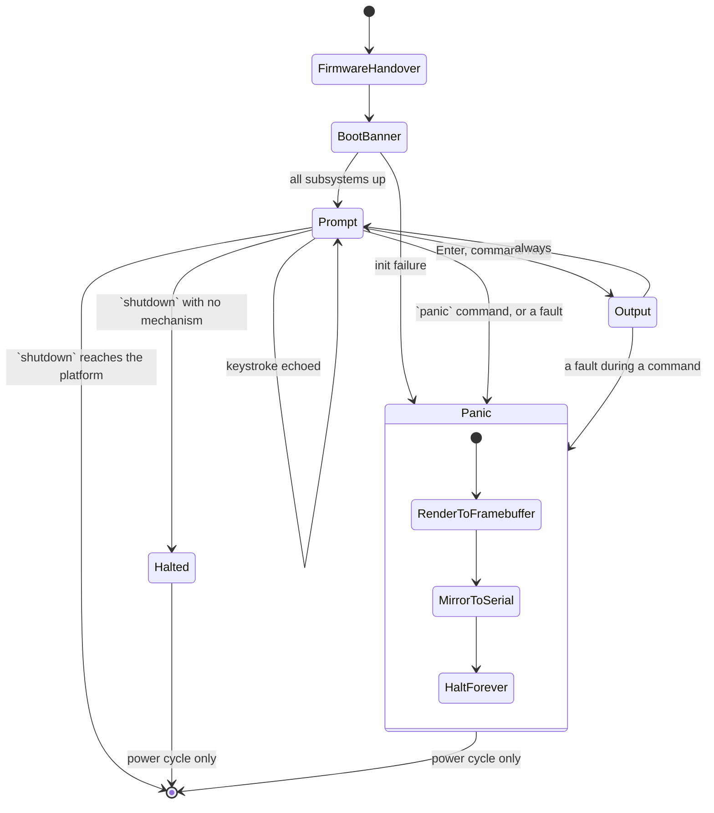

# App Flow — Osmium v1 console and shell

**Date:** 2026-08-17 · **PRD:** [PRD.md](PRD.md) · **TDD:** [TDD.md](TDD.md)

## Entry points

There is exactly one, and it is unusual enough to be worth stating plainly: **the
machine is switched on.** Osmium has no links, no redirects, no notifications and no
deep links, because it has no network and nothing outside itself. A person arrives by
one of three routes, all of which land in the same place:

1. `cargo xtask run` — boots the BIOS image in a QEMU window.
2. `cargo xtask run --uefi` — the same, under OVMF firmware.
3. Writing an image to real media and booting a physical machine. Plausible,
   untested, and described as untested.

Two non-human entry points exist and matter as much:

4. `cargo xtask test` — headless, `selftest` feature on. Runs the battery instead of
   the shell and exits QEMU with a verdict code. This is the path CI takes.
5. The **shipped-image boot job** — the default build, booted headlessly, asserted to
   reach the prompt and then killed. It proves the artefact a person actually runs.

## The happy path

1. **Firmware hands over.** The bootloader has already set up long mode, paging and
   the framebuffer. The screen is whatever the firmware left; nothing of Osmium is
   visible yet. This lasts milliseconds and has no UI of its own.
2. **Boot banner.** The console clears to the surface colour and prints the banner:
   name, version, the firmware in use, the framebuffer resolution and pixel format,
   total usable memory, and — once M5 lands — the boot-to-shell time. Below it, one
   line per subsystem as it initialises, in the same order the kernel brings them up.
   The same lines go to the serial port.
3. **Prompt.** The banner is followed by a blank line and the prompt, `osmium> `,
   with a visible caret. The kernel is idle in a halt loop between keystrokes.
4. **The person types.** Each keystroke raises an interrupt, is decoded, and is
   echoed at the caret. Backspace deletes leftwards, the arrow keys move within the
   line, and Up and Down recall history. Nothing typed is written to the serial log.
5. **They press Enter.** The line is parsed. The prompt line stays on screen, output
   is printed beneath it, and a fresh prompt follows. An unknown verb prints
   `error: unknown command 'xyz'; try 'help'`, which is an outcome, not a failure
   state: the shell is still at step 3.
6. **They keep going, or they stop.** There is no exit. `shutdown` asks the machine
   to power off; anything else leaves them at the prompt indefinitely. Closing the
   QEMU window or cutting the power ends the session, and because nothing is
   persisted, ending it destroys everything the session held.

## The command surface

Eleven commands. Each prints something; none is silent on success unless its whole
purpose is to clear the screen.

| Command | Does | Error case |
|---|---|---|
| `help` | Lists every command with a one-line description. `help <cmd>` prints the longer form. | `help nosuch` → `error: unknown command 'nosuch'`. |
| `echo <text>` | Prints its arguments back, after the shell's quoting rules. | Unterminated quote → `error: unterminated quote`. No arguments prints an empty line, which is correct, not an error. |
| `clear` | Clears the character grid and redraws, prompt at the top. | None. |
| `mem` | Heap used, free and total; usable physical memory; frames handed out; bytes zeroed so far. | None. Reads atomics and the heap's own counters. |
| `uptime` | Time since kernel entry, from the 100 Hz tick counter, as `h m s`. | Before the timer is running (only reachable in a broken build) it prints `timer not running` rather than zero, because a plausible-looking zero is worse than saying nothing is known. |
| `keymap` | Prints the active keyboard layout. `keymap uk` and `keymap us` switch it and confirm the change. | `keymap fr` → `error: unknown layout 'fr'; available: uk, us`. |
| `sysinfo` | CPU vendor and brand string, feature flags relevant to the kernel, firmware type, framebuffer geometry and pixel format, tick rate, dropped-keystroke count, build profile and whether the `selftest` feature is compiled in. | None. |
| `privacy` | Reports the three claims **as facts the build can support**, not as slogans: whether any networking or storage driver is compiled in (a compile-time constant, so it cannot drift from reality), that no filesystem is mounted because none exists, that zero-on-free is active, and the running total of bytes zeroed. Ends by naming the serial port as the one output channel and stating that typed input never reaches it. | None. |
| `panic <message>` | Deliberately panics, to demonstrate the panic screen. Documented as a demonstration, not a defect. | None — it always succeeds by failing. |
| `shutdown` | Asks the platform to power off. In QEMU this reaches the ACPI power-management port; on hardware without ACPI parsing there is no mechanism, so it falls back to a halt and prints `it is safe to switch off this machine. nothing was written to disk`, which is literally true here. | The fallback is not an error; it is the honest outcome and is worded as one. |
| `selftest` | Runs the battery interactively and prints per-phase results to the screen. **The stack-overflow phase is skipped** in interactive mode, because it cannot return and would end the session; the screen says so rather than silently omitting it. | A failing phase prints in the danger colour, prefixed `FAILED:`, and the shell returns to the prompt. |

## Every state of every screen

Four screens. Two of the template's six state columns do not exist here, and that is
recorded rather than left blank.

| Screen | Loading | Empty | Populated | Error | Unauthorised | Offline / slow |
|---|---|---|---|---|---|---|
| **Boot banner** | This screen *is* the loading state. Subsystem lines appear as each initialises, so a stall shows which subsystem it stalled in. | n/a — never empty; the banner is written before anything can be. | Banner plus initialisation lines plus the first prompt. | Init failure panics to the panic screen with the subsystem named. | **n/a — no accounts exist.** Whoever is at the keyboard is the operator. | **n/a — there is no network.** Every operation is local and completes in microseconds. |
| **Shell prompt** | n/a — no waiting; the kernel halts between keystrokes and wakes on interrupt. | The first-run state: banner, blank line, `osmium> ` and a caret. It is explained, not blank: the banner directly above it says `type 'help' for commands`. | The prompt with a partially typed line and the caret at the cursor position. | A keystroke that produces no character (an unmapped key) is ignored silently; a full input buffer beeps nothing and simply refuses the character. | n/a | n/a |
| **Command output** | n/a — every command completes in well under a frame. | A command with nothing to report says so in words: `mem` on an uninitialised heap prints `heap not initialised`, never a table of zeroes. | Output beneath the command line, then a new prompt. | `error: <what was wrong>; <what to do>`. Prefixed with `error:` in text, so the danger colour is reinforcement and never the only signal. The shell returns to the prompt; nothing is lost. | n/a | n/a |
| **Panic screen** | n/a | n/a | n/a | **This screen is only ever the error state.** A danger-coloured band across the top carrying `KERNEL PANIC`, then the panic message, the source file and line, the register state and, where a fault provided one, the faulting address. The band, not a flooded background; see the [Design Brief](DESIGN_BRIEF.md) for why. The same text goes to serial. It ends with what to do: `this machine has stopped. nothing was written to disk. power-cycle to restart.` | n/a | n/a |

Two entries above deserve to be stated outright rather than inferred from a table
cell. **Unauthorised is not applicable because Osmium has no accounts, sessions or
privilege levels in v1**. Everything runs in ring 0, and physical access is total
access. That is a deliberate scope decision recorded in the PRD, not an oversight.
**Offline is not applicable because there is no network stack**. A state that
depends on a remote response cannot occur where no remote call can be made. Both
cells stay "n/a" until ring 3 or networking exists, at which point this document is
rewritten before that code is written.

## Transitions

In the self-test build the graph is different and shorter, which is worth drawing
attention to because it is why the shipped-image boot job exists: `BootBanner` goes
to `Battery`, and `Battery` exits QEMU with 33 or 35 without ever reaching `Prompt`.

## Permissions per state

There is one privilege level and one operator, so this section is short and its
brevity is the design. Anyone who can reach the keyboard can reach every state,
including `panic` and `shutdown`. There is no state a person can be locked out of and
no state they can be ejected from, because there is nothing to authenticate against.

**What changes when access is revoked while someone is on a screen?** Nothing can be
revoked remotely; there is no channel to revoke it over. The only revocation
available is physical: switching the machine off. Because there is no persistence and
freed memory is zeroed, that revocation is complete and immediate, and it takes every
state with it. This is the same answer as in the PRD, and it is the strongest form of
the guarantee rather than the absence of one.

## Dead ends

Two states have no way forward, and both are deliberate. The rule that matters is the
one about a permanent error dressed as a transient one, and both are worded to obey
it.

- **The panic screen.** A kernel panic is terminal by definition: the kernel has
  detected that its own invariants are broken and stops rather than continuing to
  operate on state it no longer trusts. The screen therefore **never says "retry" or
  "refresh"**, because retrying is not available and implying it would be a lie. It
  says the machine has stopped, that nothing was written to disk, and that a power
  cycle is the way back. That is a complete instruction, so it is a documented
  terminal state rather than a dead end in the defect sense.
- **The halted state after `shutdown` on a platform with no power-off mechanism.**
  Also terminal, also correctly worded: `it is safe to switch off this machine`.

Everything else returns to the prompt. There is no command that leaves the shell
unresponsive, no modal state, and no way to get stuck part-way through entering
something: Escape clears the current line and returns to an empty prompt.

## Accessibility

Honesty first, because the usual framing does not transfer: **Osmium is a bare-metal
kernel with no accessibility API, no screen reader, and no assistive-technology
interface.** A screen reader running on the host operating system cannot see inside a
QEMU framebuffer window. Claiming a screen-reader story would be false. What can be
claimed is claimed, and the design choices that follow are made because of it.

- **The keyboard is the only input device, so the keyboard path is the whole
  interface**. There is no mouse to fall back to and nothing that can only be
  reached by pointing.
- **Focus is unambiguous and always visible.** There is one focus point, the caret at
  the prompt, and it is always rendered. There are no focusable elements to order and
  nothing that can steal focus.
- **Colour is never the only signal.** Errors are prefixed `error:` in text; a failing
  self-test phase is prefixed `FAILED:`; the panic screen is headed `KERNEL PANIC` in
  words. Every one of these reads correctly in monochrome, and it has to, because the
  serial log is monochrome and the serial log is what CI reads.
- **The serial console carries the same content as the screen**, which makes it the
  practical accessibility route: a person who cannot read the framebuffer can read
  the serial stream in a terminal on the host, where their own assistive technology
  works. This is a real benefit of the design rather than a consolation, and it costs
  nothing extra because the serial path exists for CI regardless.
- **Nothing blinks, nothing animates, nothing is time-limited.** There is no
  animation to reduce and no prompt that expires while someone reads it.
- **Legibility is a fixed constraint**, not a preference: see the
  [Design Brief](DESIGN_BRIEF.md) for the type sizes, the contrast floor and the
  reason the console is not dense green text on black.
