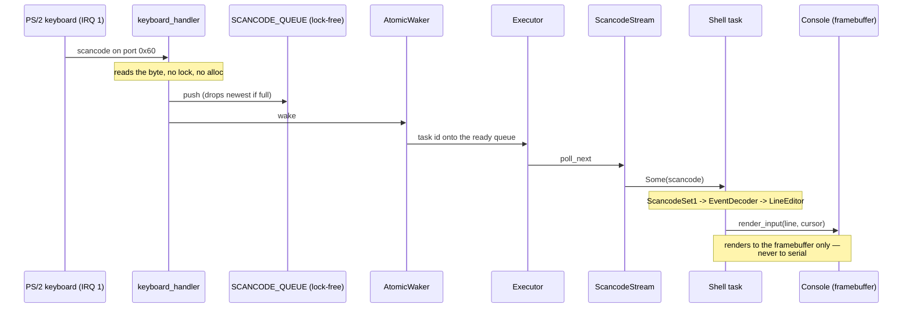
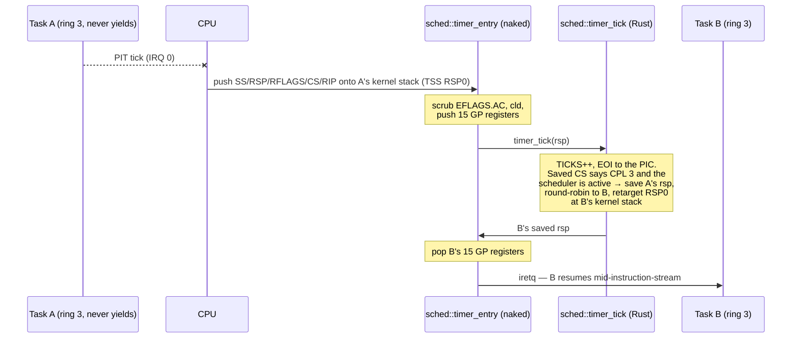

# Architecture — a walk from firmware to the shell prompt

This is the code tour the other documents don't give: where execution starts,
what each step depends on, and how a keystroke becomes a character on screen.
It anchors to module and symbol names rather than line numbers so it stays true
as the code moves.

## Boot timeline

The bootloader (`bootloader` crate, BIOS or UEFI) sets up long mode, maps the
kernel, maps **all** of physical memory at a dynamic offset (`BootloaderConfig`
in `kernel/src/main.rs`), and hands control to `kernel_main` with a `BootInfo`.
From there the init order is deliberate — each step depends on the one before:

1. **`time::mark_boot`** — records the timestamp-counter origin first, so every
   later phase measures from a real zero.
2. **`serial` up** — COM1 is the one channel that works before there is a
   screen, so the very first log line goes there.
3. **`console::init`** — wraps the framebuffer, if the firmware gave one. No
   framebuffer is a *degraded* boot, not a dead one: the console stays absent,
   the kernel logs the fallback, and boot and the self-test battery still pass
   over serial. (The shell renders to the console only — the keystroke-privacy
   rule — so this configuration is boot-proven, not interactive.)
4. **`logger::init`** — one `log` sink fanning out to serial and (once it
   exists) the console.
5. **`gdt::init`** — the GDT (kernel *and* ring-3 user segments), the TSS with
   three IST stacks, and the RSP0 privilege stack the CPU switches to when ring 3
   traps in. This runs **before
   the IDT** on purpose: the double-fault handler is wired to IST slot 0, so the
   stack it will run on must exist before any handler is installed.
6. **`interrupts::init`** — loads the IDT (every defined exception vector, the
   keyboard IRQ, the timer vector wired to `sched::timer_entry` — a naked
   handler installed by address, because preemption needs to save and swap the
   full register file — and the `int 0x80` gate at DPL 3 so ring 3 may issue
   it), remaps the PIC clear of the exception vectors,
   programs the PIT to 100 Hz, then enables interrupts.
7. **`memory::init`** — enables EFER.NXE first (so NX mappings are honoured),
   then builds the frame allocator over the boot memory map, the
   `OffsetPageTable` over the physical-memory mapping, and the 1 MiB kernel
   heap — mapped writable and NX. After this line `alloc` works and the
   executor can run.
8. **Then the build diverges.** The shipped build spawns the shell task on a
   cooperative executor and runs it. The self-test build calibrates the TSC
   against the PIT, prints the boot phases, and runs the battery — which ends by
   deliberately overflowing the kernel stack to prove the IST double-fault
   guard catches it.

## Keystroke dataflow

The path from a key press to a glyph is the clearest illustration of the
kernel's two hard rules: interrupt handlers **never allocate and take no lock
but the PIC's** (for the end-of-interrupt write, which the main thread never
holds once interrupts are enabled),
and typed input **never reaches the serial port**.

The interrupt handler (`interrupts::keyboard_handler`) does the minimum: read
the data port, push into a lock-free `ArrayQueue`, wake the shell task, and
acknowledge the PIC (`end_of_interrupt` — the one lock a handler ever takes,
held for a few instructions). The
`AtomicWaker` re-arms after every wake, and the queue has capacity 128, so the
handler can never block or allocate. Everything expensive — decoding, editing,
rendering — happens in the shell task, in ordinary code, with the console lock
that the handler is forbidden to touch.

The `Console` renders each keystroke to the framebuffer through `render_input`,
which also draws the caret. No function on this path writes to serial; CI's
`input-path-has-no-serial` gate greps `shell.rs` and `task/keyboard.rs` to keep
it that way, and `cargo xtask privacy` proves it at runtime by typing a sentinel
and asserting the serial log never contains it.

## The ring-3 round trip

The `user` command (and the battery's `user_program_runs_in_ring3` check) walks
the kernel's one privilege boundary end to end — since M8 as the one-task
degenerate case of the scheduler. In symbol order:

1. **`usermode::run_hello`** hands the embedded `user/hello` ELF — a real,
   linker-scripted Rust binary built by the kernel's build script — to
   **`run_programs`**, which starts with **`kshared::elf::parse_elf64`** per
   image. The parser
   is refusal-first and host-tested: bad magic, truncation, a W+X segment, an
   out-of-window or unaligned vaddr, overlapping segments, an oversize load or
   a non-executable entry are all `Err` before anything is mapped — and
   `run_programs` adds the cross-image form of the same rule: two programs
   claiming overlapping pages are refused before any page is mapped.
2. **A private world per program (M9), then map, copy, lock.** Each program
   gets its own **`memory::AddressSpace`** — the kernel's PML4 cloned with
   every kernel subtree shared and the user region's page-table slots private
   (the low-half contents this rests on were measured, not assumed; the
   constructor's comment records the two bootloader mappings it must keep
   shared, and asserts the user slots are vacant). Each `PT_LOAD` segment is
   then mapped writable **and NX** into that space, the file bytes are copied
   in through the kernel's physical alias (the `memsz` tail is BSS, already
   correct because frames arrive zeroed), and
   **`AddressSpace::update_user_page`** locks each page to its final
   per-segment W^X permissions, adjusting the W and NX bits and touching
   nothing else — a page is never writable and executable at the same time,
   even transiently. The stack page (`USER_STACK_ADDR` — the SAME virtual
   address in every space) is mapped user-writable, never executable.
3. **`sched::install` + `sched::enter_tasks`.** `install` gives each task its
   own kernel stack and fabricates its initial saved context — 15 zeroed GP
   registers (ring 3 sees no kernel state) under an `iretq` frame with the
   ring-3 selectors — then points TSS RSP0 at task 0's stack. `enter_tasks`
   (naked) pushes the callee-saved registers, saves the kernel stack pointer
   into `KERNEL_CONTINUATION_RSP`, and restores task 0's fabricated context:
   the same pop-15/`iretq` tail every later resume uses, so first launch and
   resume are one code path.
4. **`int80_entry`** (naked, installed at DPL 3) is the way back. It scrubs
   `EFLAGS.AC` and runs `cld` before any Rust code; `SYS_EXIT` hands the exit
   value to `sched::sys_exit`, which either resumes the next ready task's
   saved context (loading that task's RSP0 **and CR3**) or — when the last
   task exits — deactivates the scheduler, restores the default RSP0 and the
   kernel's own CR3, and lets the entry return into the launcher.
   Any other syscall marshals into the SysV ABI, calls `syscall_dispatch`,
   scrubs the caller-saved registers (keeping `rax`) and `iretq`s back to the
   program. `SYS_WRITE` renders its byte to the local console, never serial:
   the shipped `user`/`sched`/`crash` commands must not grow an off-device
   output channel, and `cargo xtask privacy` types all three to prove it.
   **`sched::kill_current`** (M10) is the involuntary counterpart of
   `sys_exit`: every fault handler forks on the faulting CPL — ring 3 calls
   `kill_current(vector)`, which scrubs `EFLAGS.AC`, marks the task
   fault-terminated with the vector that killed it, and takes the same two
   exits `sys_exit` does (resume the next ready task's context with its RSP0
   and CR3, or restore the kernel's world and return to the launcher), via
   naked never-returning helpers sharing the canonical pop-15/`iretq` restore
   tail. A CPL-0 fault still panics: a kernel bug is not a schedulable event,
   and NMI, machine check and double fault stay panic-only at any CPL because
   they report machine-level events, not something the current task did.
5. **Teardown and audit.** Teardown is dropping the spaces: the kernel's own
   table was never touched, so there is nothing to unmap — the per-task tables
   and user frames leak (bump allocator), and the per-task kernel stacks are
   freed (and therefore zeroed — the allocator scrubs on free).
   **`memory::no_stray_user_mappings`** then re-audits the KERNEL's table in
   its M9 total form: not one user-accessible entry, leaf or intermediate,
   anywhere, ever. The battery runs that audit both before ring 3 has ever
   run and again after every scenario.

The boundary is stated, not oversold: each run leaks its few mapped frames
and page-table frames until frame reclamation exists. What M9 removed from
this list is memory sharing: tasks are now isolated from each other as well
as from the kernel, proven by two instances of one image at one virtual
address each seeing only its own data. What M10 removed is fault fatality: a
ring-3 fault now terminates the offending task alone — the battery proves it
by page-faulting `crasher` beside a healthy `hello` and asserting the
neighbour, the run report and the kernel all came through intact, then by
faulting the LAST task alive to force the return-to-launcher branch of the
kill path deterministically.

## The preemptive context switch (M8)

The timer path is the one place the kernel swaps register files, and its whole
design fits in one sequence:

The invariants that make it sound are four, and each is asserted rather than
assumed. **Only CPL 3 is preempted**: `timer_tick` reads the saved CS and
returns unchanged for kernel contexts, so the kernel is non-preemptible and the
locking rules stay simple. **Every task traps onto its own kernel stack**:
RSP0 is rewritten at every switch, because two tasks sharing one privilege
stack would overwrite each other's saved frames. **Every task runs in its own
address space (M9)**: CR3 is loaded beside RSP0 at every switch — sound under
the kernel's feet because every space's kernel half is a clone of the kernel's
own table — so the resumed task sees only its private user mappings. **The
saved context has one
format** — 15 GP registers in a fixed order under the CPU's interrupt frame —
shared by the timer's save, `install`'s fabricated initial frames, and the
restore tails in both the timer and syscall entries. The battery proves the
behaviour rather than the diagram: an unyielding compute program is preempted
(a later-launched program exits first), its checksum survives every switch
bit-exact, a program that holds `EFLAGS.AC` set for its whole run never
gets it past the entry scrub, and two instances of one image at one virtual
address each see only their own memory.

## Where to read next

- The full memory map, global-state table and unsafe-block inventory are in
  [TDD.md](TDD.md).
- What the shell does and every screen state are in [APP_FLOW.md](APP_FLOW.md).
- The scope, success criteria and deliberate non-goals are in [PRD.md](PRD.md).
