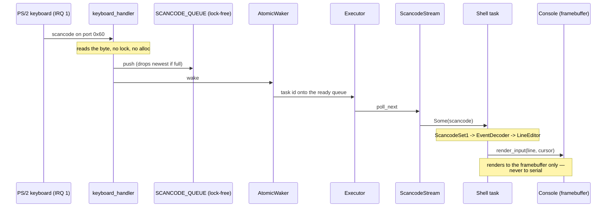

# Architecture — a walk from firmware to the shell prompt

This is the code tour the other documents don't give: where execution starts,
what each step depends on, and how a keystroke becomes a character on screen.
It anchors to module and symbol names rather than line numbers so it stays true
as the code moves.

## Boot timeline

The bootloader (`bootloader` crate, BIOS or UEFI) sets up long mode, maps the
kernel, maps **all** of physical memory at a dynamic offset (`BootloaderConfig`
in `kernel/src/main.rs`), and hands control to `kernel_main` with a `BootInfo`.
From there the init order is deliberate — each step depends on the one before:

1. **`time::mark_boot`** — records the timestamp-counter origin first, so every
   later phase measures from a real zero.
2. **`serial` up** — COM1 is the one channel that works before there is a
   screen, so the very first log line goes there.
3. **`console::init`** — wraps the framebuffer, if the firmware gave one. No
   framebuffer is a *degraded* boot, not a dead one: the console stays absent
   and everything else still runs over serial.
4. **`logger::init`** — one `log` sink fanning out to serial and (once it
   exists) the console.
5. **`gdt::init`** — the GDT, the TSS, and three IST stacks. This runs **before
   the IDT** on purpose: the double-fault handler is wired to IST slot 0, so the
   stack it will run on must exist before any handler is installed.
6. **`interrupts::init`** — loads the IDT (every defined exception vector plus
   the timer and keyboard IRQs), remaps the PIC clear of the exception vectors,
   programs the PIT to 100 Hz, then enables interrupts.
7. **`memory::init`** — builds the frame allocator over the boot memory map, the
   `OffsetPageTable` over the physical-memory mapping, and the 1 MiB kernel
   heap. After this line `alloc` works and the executor can run.
8. **Then the build diverges.** The shipped build spawns the shell task on a
   cooperative executor and runs it. The self-test build calibrates the TSC
   against the PIT, prints the boot phases, and runs the battery — which ends by
   deliberately overflowing the kernel stack to prove the IST double-fault
   guard catches it.

## Keystroke dataflow

The path from a key press to a glyph is the clearest illustration of the
kernel's two hard rules: interrupt handlers **never lock and never allocate**,
and typed input **never reaches the serial port**.

The interrupt handler (`interrupts::keyboard_handler`) does the minimum: read
the data port, push into a lock-free `ArrayQueue`, wake the shell task. The
`AtomicWaker` re-arms after every wake, and the queue has capacity 128, so the
handler can never block or allocate. Everything expensive — decoding, editing,
rendering — happens in the shell task, in ordinary code, with the console lock
that the handler is forbidden to touch.

The `Console` renders each keystroke to the framebuffer through `render_input`,
which also draws the caret. No function on this path writes to serial; CI's
`input-path-has-no-serial` gate greps `shell.rs` and `task/keyboard.rs` to keep
it that way, and `cargo xtask privacy` proves it at runtime by typing a sentinel
and asserting the serial log never contains it.

## Where to read next

- The full memory map, global-state table and unsafe-block inventory are in
  [TDD.md](TDD.md).
- What the shell does and every screen state are in [APP_FLOW.md](APP_FLOW.md).
- The scope, success criteria and deliberate non-goals are in [PRD.md](PRD.md).
