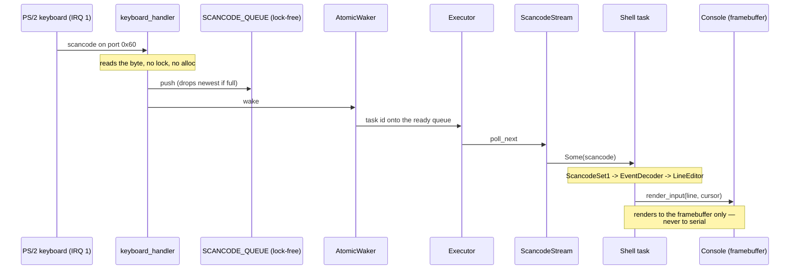

# Architecture — a walk from firmware to the shell prompt

This is the code tour the other documents don't give: where execution starts,
what each step depends on, and how a keystroke becomes a character on screen.
It anchors to module and symbol names rather than line numbers so it stays true
as the code moves.

## Boot timeline

The bootloader (`bootloader` crate, BIOS or UEFI) sets up long mode, maps the
kernel, maps **all** of physical memory at a dynamic offset (`BootloaderConfig`
in `kernel/src/main.rs`), and hands control to `kernel_main` with a `BootInfo`.
From there the init order is deliberate — each step depends on the one before:

1. **`time::mark_boot`** — records the timestamp-counter origin first, so every
   later phase measures from a real zero.
2. **`serial` up** — COM1 is the one channel that works before there is a
   screen, so the very first log line goes there.
3. **`console::init`** — wraps the framebuffer, if the firmware gave one. No
   framebuffer is a *degraded* boot, not a dead one: the console stays absent,
   the kernel logs the fallback, and boot and the self-test battery still pass
   over serial. (The shell renders to the console only — the keystroke-privacy
   rule — so this configuration is boot-proven, not interactive.)
4. **`logger::init`** — one `log` sink fanning out to serial and (once it
   exists) the console.
5. **`gdt::init`** — the GDT (kernel *and* ring-3 user segments), the TSS with
   three IST stacks, and the RSP0 privilege stack the CPU switches to when ring 3
   traps in. This runs **before
   the IDT** on purpose: the double-fault handler is wired to IST slot 0, so the
   stack it will run on must exist before any handler is installed.
6. **`interrupts::init`** — loads the IDT (every defined exception vector, the
   timer and keyboard IRQs, and the `int 0x80` gate at DPL 3 so ring 3 may issue
   it), remaps the PIC clear of the exception vectors,
   programs the PIT to 100 Hz, then enables interrupts.
7. **`memory::init`** — enables EFER.NXE first (so NX mappings are honoured),
   then builds the frame allocator over the boot memory map, the
   `OffsetPageTable` over the physical-memory mapping, and the 1 MiB kernel
   heap — mapped writable and NX. After this line `alloc` works and the
   executor can run.
8. **Then the build diverges.** The shipped build spawns the shell task on a
   cooperative executor and runs it. The self-test build calibrates the TSC
   against the PIT, prints the boot phases, and runs the battery — which ends by
   deliberately overflowing the kernel stack to prove the IST double-fault
   guard catches it.

## Keystroke dataflow

The path from a key press to a glyph is the clearest illustration of the
kernel's two hard rules: interrupt handlers **never allocate and take no lock
but the PIC's** (for the end-of-interrupt write, which the main thread never
holds once interrupts are enabled),
and typed input **never reaches the serial port**.

The interrupt handler (`interrupts::keyboard_handler`) does the minimum: read
the data port, push into a lock-free `ArrayQueue`, wake the shell task, and
acknowledge the PIC (`end_of_interrupt` — the one lock a handler ever takes,
held for a few instructions). The
`AtomicWaker` re-arms after every wake, and the queue has capacity 128, so the
handler can never block or allocate. Everything expensive — decoding, editing,
rendering — happens in the shell task, in ordinary code, with the console lock
that the handler is forbidden to touch.

The `Console` renders each keystroke to the framebuffer through `render_input`,
which also draws the caret. No function on this path writes to serial; CI's
`input-path-has-no-serial` gate greps `shell.rs` and `task/keyboard.rs` to keep
it that way, and `cargo xtask privacy` proves it at runtime by typing a sentinel
and asserting the serial log never contains it.

## The ring-3 round trip

The `user` command (and the battery's `user_program_runs_in_ring3` check) walks
the kernel's one privilege boundary end to end. In symbol order:

1. **`usermode::run_hello`** hands the embedded `user/hello` ELF — a real,
   linker-scripted Rust binary built by the kernel's build script — to
   **`run_elf`**, which starts with **`kshared::elf::parse_elf64`**. The parser
   is refusal-first and host-tested: bad magic, truncation, a W+X segment, an
   out-of-window or unaligned vaddr, overlapping segments, an oversize load or
   a non-executable entry are all `Err` before anything is mapped.
2. **Map, copy, lock.** Each `PT_LOAD` segment is mapped writable **and NX**
   (`memory::map_user_page`), the file bytes are copied in (the `memsz` tail is
   BSS, already correct because frames arrive zeroed), and then
   **`memory::update_user_page`** locks each page to its final per-segment W^X
   permissions, adjusting the W and NX bits and touching nothing else — a page
   is never writable and executable at the same time, even transiently. The
   stack page (`USER_STACK_ADDR`) is mapped user-writable, never executable.
3. **`jump_to_user`** (naked) pushes the callee-saved registers, saves the
   kernel stack pointer into `KERNEL_CONTINUATION_RSP`, builds the `iretq`
   frame with the ring-3 selectors, scrubs every GP register so ring 3 sees no
   kernel state, and `iretq`s to the entry point at CPL 3.
4. **`int80_entry`** (naked, installed at DPL 3) is the way back. It runs `cld`
   before any Rust code; `SYS_EXIT` records the exit value, restores the saved
   kernel stack and its callee-saved registers, and returns into the launcher.
   Any other syscall marshals into the SysV ABI, calls `syscall_dispatch`,
   scrubs the caller-saved registers (keeping `rax`) and `iretq`s back to the
   program. `SYS_WRITE`'s byte goes to serial deliberately: it is
   program-supplied output that lets the CI log show the syscall ran, not typed
   input.
5. **Teardown and audit.** `run_elf` unmaps every user page (the frames are not
   reclaimed — bump allocator), and **`memory::no_stray_user_mappings`** then
   re-audits the live page tables: no user-accessible leaf anywhere, and
   user-accessible intermediates only where they reach the declared user
   window. The battery runs that audit both before ring 3 has ever run and
   again after teardown.

The boundary is stated, not oversold: a misbehaving user program is fatal
(every exception handler panics — there is no process model to terminate just
the program), the loader is one-program-at-a-time by design, and each run leaks
its few mapped frames until frame reclamation exists.

## Where to read next

- The full memory map, global-state table and unsafe-block inventory are in
  [TDD.md](TDD.md).
- What the shell does and every screen state are in [APP_FLOW.md](APP_FLOW.md).
- The scope, success criteria and deliberate non-goals are in [PRD.md](PRD.md).
